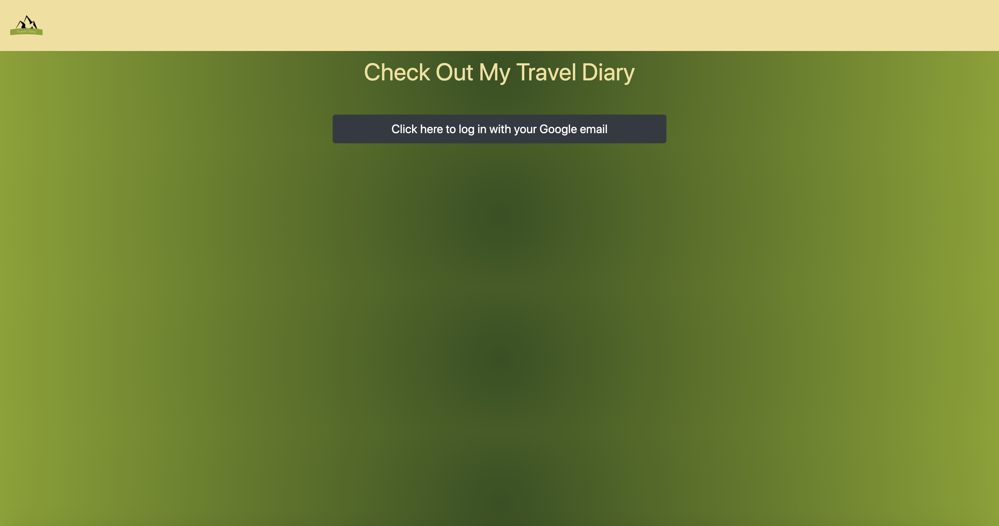
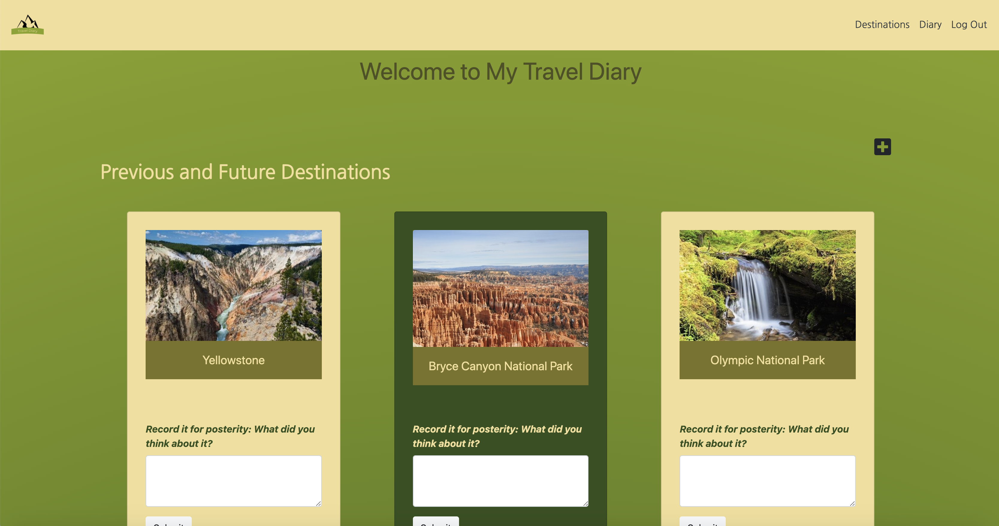
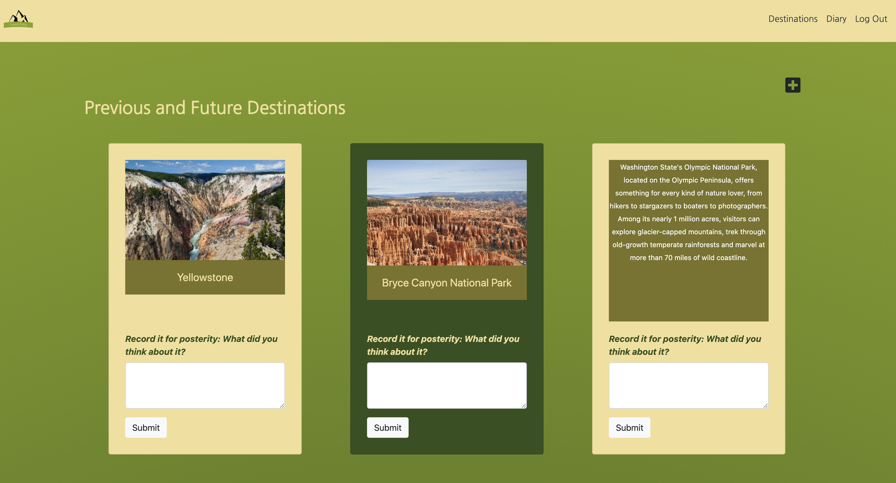
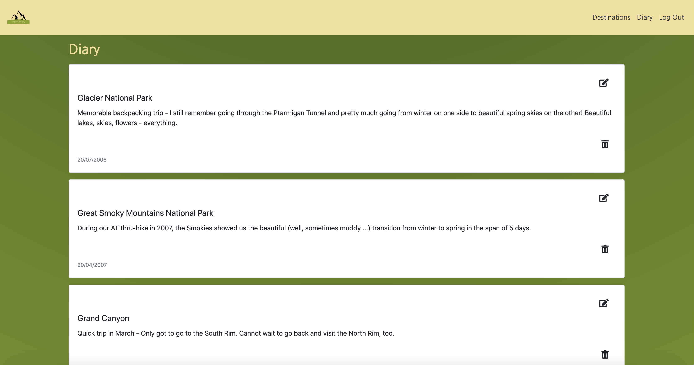
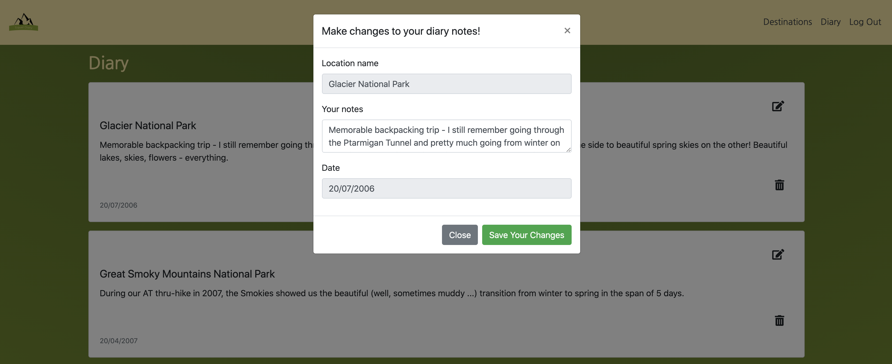
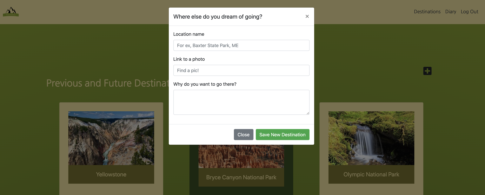

# Travel Diary

## Description
The Travel Diary app was a bonus project I tackled during our spring break. It is an online journal that allows users to keep track of destinations on their bucket list and then capture diary entries when they actually get to visit these sites. 

## Background
This project was a great opportunity to keep practicing my skills manipulating data across multiple collections in a Firebase database. It helped me improve my ability to outline the logic and code for what we at NSS call "smash" functions, that is, functions that pull data from multiple collections; it also helped me get even more comfortable with various CSS components such as Bootstrap modals and Javascript elements, such as .parse() methods and the spread operator. 

This project also gave me the opportunity to outline some of the destinations truly on my own bucket list - which would be all of the US national parks. I have been fortunate enough to visit a few of them. Hopefully, I can slowly work my way through the very lengthy and amazing list of national parks we are so fortunate to have access to here in the US.

Project instructions can be found here: https://github.com/nss-nightclass-projects/exercise-vault/blob/master/MODULES_travel_diary.md.

## Screenshots
##### Login Page

##### Home Page

##### Destinations Section

##### Diary Section

##### Edit a Diary Entry Modal

##### Add a Destination Modal

## Features
1. In the Destinations section, users can view a list of destinations they want to visit and their details, including name, image, and description. 
1. Users can see the description by hovering over the destination picture. 
1. Users can add new destinations. 
1. In the Diary section, users can see the diary entires they made in the past when visited some of these sites.
1. When users visit one of their destinations for the first time or anew, they can enter their impressions about the experience in the input text field on that card and submit them, which automatically creates a diary entry in their Diary section. 
1. The diary entry displays the name of the location from the card, a timestamp, and the comments the user entered.
1. Newest diary entries appear at the bottom. 
1. Once a user has written about a place at least once, the color of the card changes from a light tan background to a dark green backgroudn to indicate they made it there.
1. Users can delete diary entries.
1. Users can edit their diary entries.

## Technologies & Tools
Axios API, Bootstrap, CSS, ES6 Modules, ESLint, Firebase (for authentication & data management), Github (for version control & project planning), Google login authentication via Firebase, HTML5, Javascript, jQuery, JSON, JSONLint, Lucidchart (for ERD review), Sass, Webpack

## How to Run
1. Clone down this repo.
1. Make sure you have http-server installed via npm. If not, get it [here](https://www.npmjs.com/package/http-server).
1. On your command line, run `hs -p 9999`.
1. In your browser, navigate to `http://localhost:9999`.

## Firebase Deployment
This project has been deployed with Firebase. 
You can access it [here](https://traveldiary-78295.web.app/#). 
